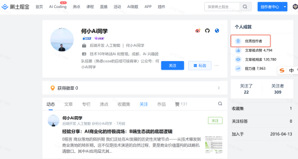
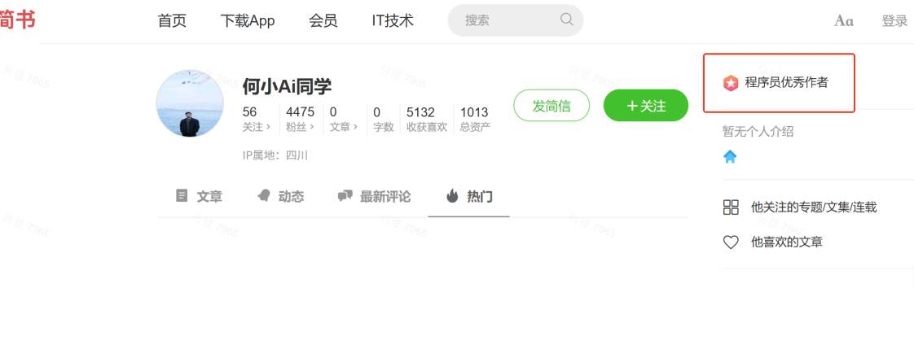
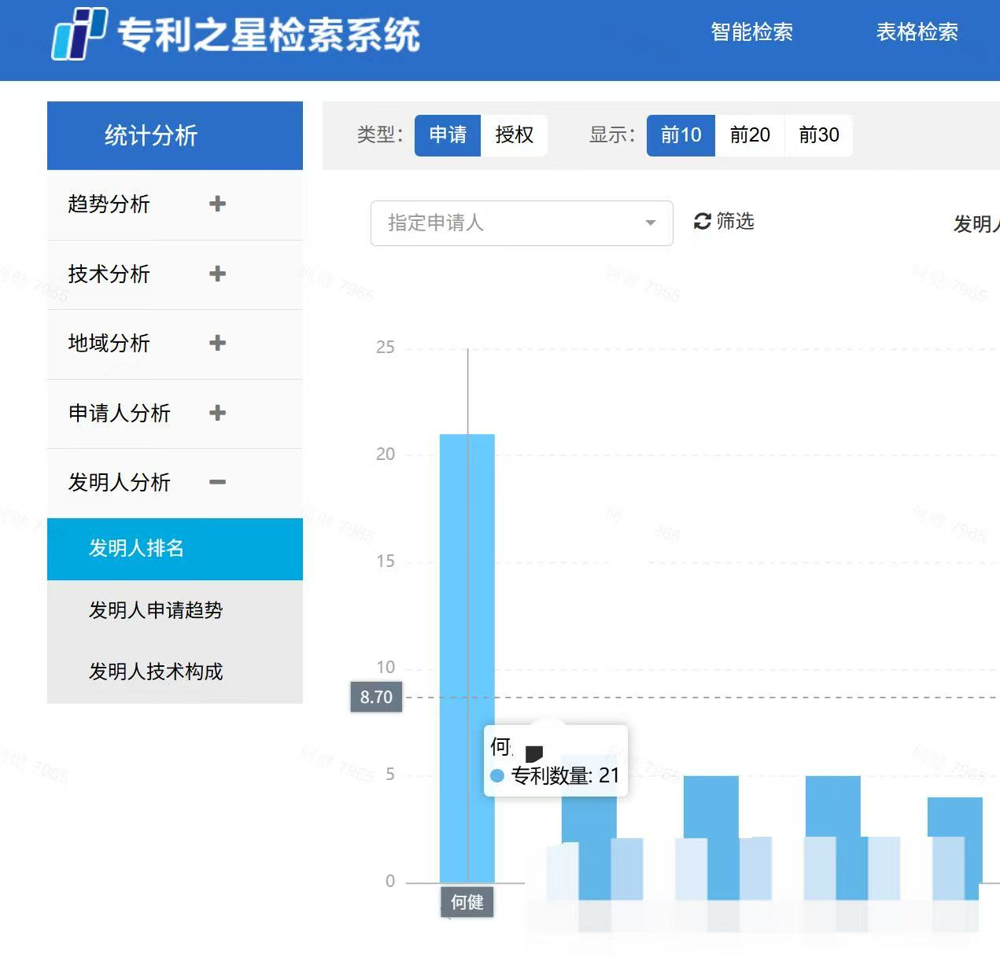
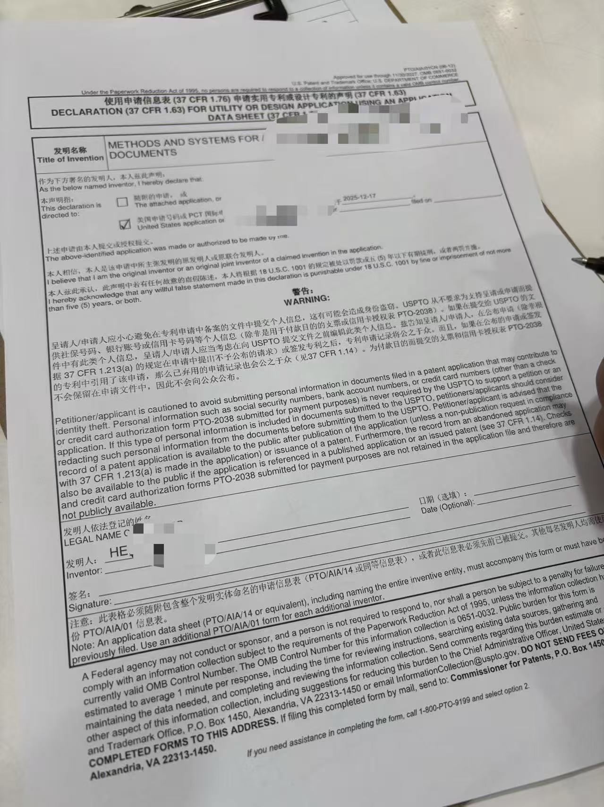
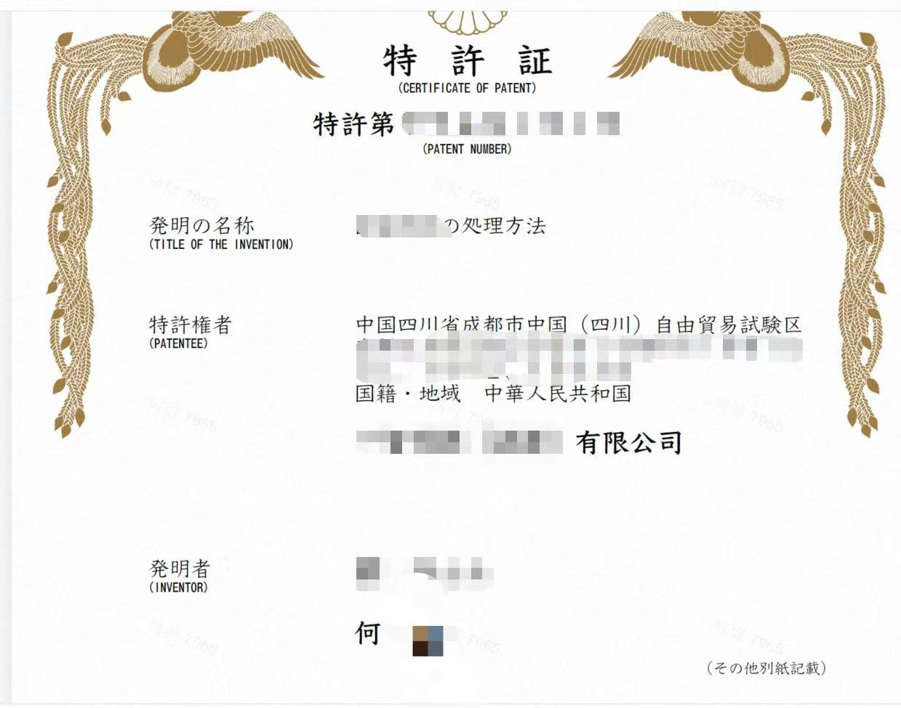
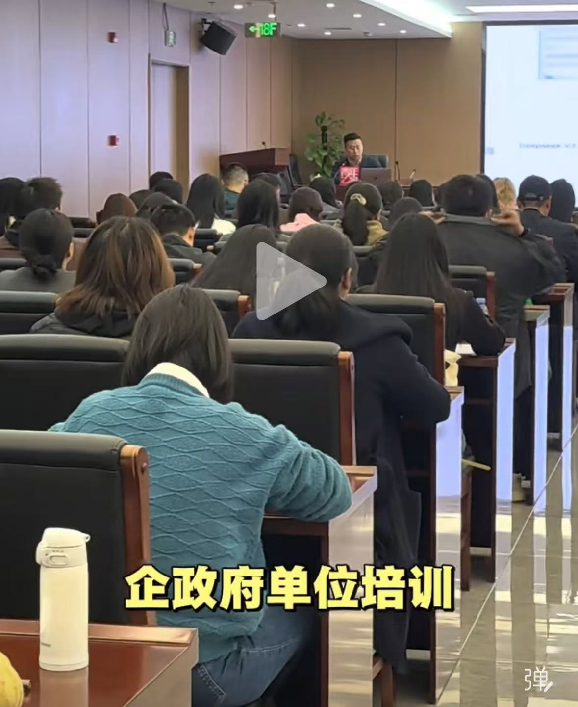
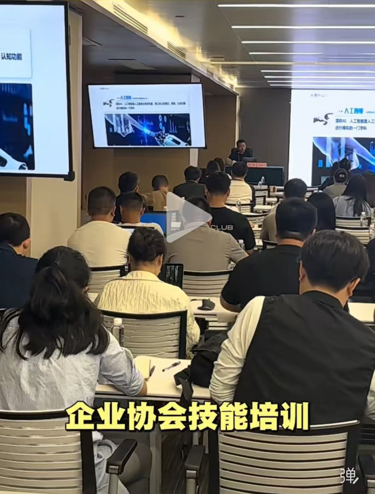

# ProgrammerAnthony

> **AI 工程落地 · 后端与中间件 · 专利与开源**  
> 求职 / 合作 · Base：**成都** AI应用开发工程师 薪资30K+
> 联系方式： 18380437965 cameloeanthony@gmail.com

---

## AI 工程落地

10 年研发，近 3 年聚焦 AI 工程：**编排引擎二次开发**、**LLM 统一网关**、**插件化体系**、**Prompt 工程化**、**RAG 知识分层**、**精排与混合检索**、**LangGraph / React RAG**、**AI 记忆体系**；熟悉 **Dify**、**LangChain**、**Coze** 等完整链路。

## 后端与中间件

深耕 **Spring Cloud** 与中间件二次开发，主导自研微服务治理中心（注册中心、配置中心、网关）全流程；亿级数据场景下 **Elasticsearch**、**MySQL**、**Redis** 调优；熟悉高并发电商、车联网海量数据处理等架构。

## 专利与知识产出

第一作者计算机专利 **20+**（含美国、日本及 AI 相关）；指导公司专利 **40+**。擅长技术提炼与知识转化，开源 [PatentSkills](https://github.com/ProgrammerAnthony/PatentSkills) 辅助专利自动化挖掘。

## 开源与影响力

GitHub **Star 5000+**。代表项目：[Pantheon](https://github.com/ProgrammerAnthony/Pantheon)（分布式注册中心）、[Haafiz](https://github.com/ProgrammerAnthony/Haafiz)（分布式网关）、[Anything-Extract](https://github.com/ProgrammerAnthony/Anything-Extract)（大模型知识提取）。简书优秀作者、掘金专栏作者；主导 AI 专题培训 **20+** 场，累计逾千人次。

## AI 时代全栈实践

**90%+** 代码由 AI 辅助实现，覆盖 **Java**、**Python**、**Next.js**、**Android**、**iOS**、小程序；**PRD → 开发 → 测试** 体系化方法论，[Expert-Coding-Skills](https://github.com/ProgrammerAnthony/Expert-Coding-Skills) 覆盖 AI 开发全流程，能快速将需求落地为可交付产品。

---

## 配图与专利证书

<!-- 两列表格；每图 max-width 440px、高 280px、object-fit: cover 统一裁切区域 -->
<table align="center" width="100%" style="max-width: 920px; border-collapse: separate; border-spacing: 8px;">
  <tr>
    <td width="50%" align="center" valign="middle">
      
    </td>
    <td width="50%" align="center" valign="middle">
      
    </td>
  </tr>
  <tr>
    <td width="50%" align="center" valign="middle">
      
    </td>
    <td width="50%" align="center" valign="middle">
      
    </td>
  </tr>
  <tr>
     <td width="50%" align="center" valign="middle">
      
    </td>
    <td width="50%" align="center" valign="middle">
      
    </td>
  </tr>
  <tr>
    <td width="50%" align="center" valign="middle">
      
    </td>
    <td width="50%" align="center" valign="middle">
      
    </td>
  </tr>
</table>
